# REACT & REDUX CHEAT SHEET

## SECTION 1 - Let's Dive In!
- INSTALL Create React App Package:

	```
	npm install -g create-react-app
	```

- CREATE New Project

	```
	npx create-react-app <APP_NAME>
	```
	
- START Project

	```
	cd <APP_NAME>
	npm start
	```

- `Babel:` Which is a toolchain that is mainly used to convert ECMAScript 2015+ (ES20015 and newer versions) code into a backwards compatible version of JavaScript in current and older browsers or environments. Babel also converts our JSX code to javascipt code as well.

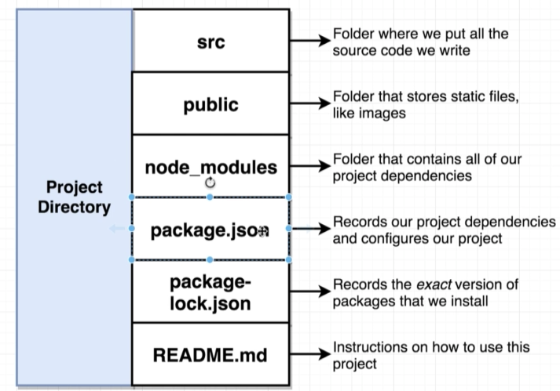
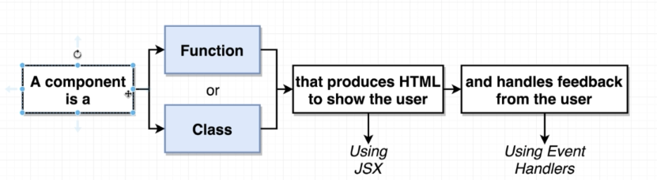


## SECTION 2 - Building Content with JSX
- Babeljs : [Babel Link](https://babeljs.io/)
- Html Versus JSX :
	- One difference is between inline style. JSX uses camelcase style <br/>
	  	__HTML__ `<div style="background-color: red; color: white;"></div>`<br/>
	  	__JSX__  `<div style={{backgroundColor: 'red', color: 'white'}}></div>`
	- Use __className__ insted of __class__
	- JSX can reference JS variable or function
	
		```javascript
		const App = () => {
			const text = 'Some Text';
    		return <div>{text}</div>
		}
		```
		
		```javascript
		const getText = () => {
    		return 'Some Other Text'
		}
		
		const App = () => {
    		return <div>{getText()}</div>
		}
		```
	- Use __htmlFor__ instead of __for__


## SECTION 3 - Communication with Props
- `Props:` Which is a system for passing data from a parent component to a child component. Goal is to customize or configure a child component.<br/>

- Example of props <br/>
	Here is one component :
	
	```javascript
	const SomeComponent = props => {
	    return (
	        <div>
	            <span className="someData">{props.someData}</span>
	        </div>
	    );
	};
	
	export default SomeComponent;
	```
	
	And using that component with props:
	
	```javascript
	import SomeComponent from './SomeComponent'
	
	const SomeOtherComponent = props => {
	    return (
	        <div>
	            <SomeComponent someData='Some Data....'/>
	        </div>
	    );
	};
	
	export default SomeOtherComponent;
	```

- Using of children example with `props.children`: <br/>
	Wrapper Component :
	
	```javascript
 	const ApprovalCard = props => {
	    return (
	        <div className="ui card">
	            <div className="content">{props.children}</div>
	            <div className="extra content">
	                Some other components or divs...
	            </div>
	        </div>
	    );
	};
	
	export default ApprovalCard;
	```

	Usage of wrapper component:
	
	```javascript
	<SomeWrapperComponent>
        <div>Are you sure you want to do this?</div>
    </SomeWrapperComponent>
	```

## SECTION 4 -  Structuring Apps with Class-Based Components
### Benefits of Class Component:
- Easier code organization
- Can use 'state' -> Easier to handle user input
- Understands lifecycle events -> Easier to do things when the app first starts

### Rules of Class Component:
- Must be a JS Class
- Must extend from React.Component
- Must define a 'render' method that returns some amount of JSX.
- Example of simple class component:

	```javascript
	import React from 'react'
	
	class SomeComponent extends React.Component {
		render() {
			return <div>Some Elements....</div>
		}
	}
	
	export default SomeComponent;
	```
	
- If you want to have a constructor you have to give props as argument and pass to super:

	```javascript
	import React from 'react'
	
	class SomeComponent extends React.Component {
		constructor(props) {
			super(props);
		}
		
		render() {
			return <div>Some Elements....</div>
		}
	}
	
	export default SomeComponent;
	```

## SECTION 5 - State in React Components
### Rules of State System in React
- Only usable with class components (Technically can be used with functional components as well with using the new 'hooks' system)
- Do __NOT__ confuse props with state
- 'State' is a JS object that contains data relevant to a component
- Updating a 'state' on a component causes the component to (almost) instantly rerender
- State must be initialized when a component is created
- State can __ONLY__ be updated using the function 'setState' (For the first time to create state object you can use assingment `this.state = {...})`
- Example of state usage: 

	```javascript
	import React from 'react'
	
	class SomeComponent extends React.Component {
		constructor(props) {
			super(props);
			this.state = {someProp: null}
		}
		
		loadSomething() {
			this.setState({someProp: 'SomeObject'})
		}
		
		render() {
			return <div>Some Elements....</div>
		}
	}
	
	export default SomeComponent;
	```

## SECTION 6 - Understanding Lifecycle Methods
### Component Lifecycle (From Start to End in Time)

```javascript
// (Good place to do one time setup)
constructor(props)

// (Avoid doing anything besides returning JSX)
render()

// (Content visible on screen - Good place to do data-loading)
componentDidMount()

// (Sit and wait for updates)
// Good place to do more data-loading when state/props change
componentDidUpdate()

// (Sit and wait until this component is not longer shown)
// Good place to do cleanup (especially for non-React stuff)
componentWillUnmount()
```

### Other lifecycle methods (rarely used)
```javascript
shouldComponentUpdate()
getDerivedStateFromProps()
getSnapshotBeforeUpdate()
```

### NOTES:
- You don't need to create a constructor if you just want to create initial state object. Example is given below:

	```javascript
	class App extends React.Component {
	    constructor(props) {
	        super(props);
	        this.state = {lat: null, err: ''};
	    }
	}
	
	// is the same with:
	
	class App extends React.Component {
	    state = {lat: null, err: ''};
	
	    ...
	}
	```

- If you want to have default props you can use in two ways:

	- First way:

		```javascript
		// ES6 class
		class CatComponent extends React.Component {
		    constructor(props) {
		      super(props);
		    }
		    render() {
		        return <div>{this.props.catName || "Sandy"}</div>
		    }
		}
		
		// Functional component
		function CatComponent(props) {
		    return <div>{props.catName || "Sandy"}</div>
		}
		```

	- Second way:

		```javascript
		// ES6 class
		class CatComponent extends React.Component {
		    constructor(props) {super(props);}
		    render() {
		        return <div>{this.props.catName}</div>
		    }
		}
		CatComponent.defaultProps = {
		    catName: "Sandy"
		}
		// or
		class CatComponent extends React.Component {
		    constructor(props) {super(props);}
		    static defaultProps = {
		      catName: "Sandy"
		    }
		    render() {
		        return <div>{this.props.catName} </div>
		    }
		}
		// Functional component
		function CatComponent(props) {
		    return <div>{props.catName}</div>
		}
		CatComponent.defaultProps = {
		    catName: "Sandy"   
		}
		```

- __IMPORTANT !!__ -> ```setState()``` method is not changing whole state object. It is an additive method. It is just changing which we gave

	```javascript
	class App extends React.Component {
	    state = {lat: null, err: 'ERROR'};
	
	    componentDidMount() {
	        // THAT IS ONLY GOING TO CHANGE lat PROPERTY INSIDE OUR STATE!.
	        // IT IS NOT GOING TO CHANGE err
	        this.setState({lat: 52});
	    }
	    // Other functions, render method...
	}
	```

## SECTION 7 - Handling User Input with Forms and Events
### Some events:
- User clicks on something -> ```onClick```
- User changes text in an input -> ```onChange```
- User submits a form -> ```onSubmit```

### Solving Context Issue for ```this``` keyword in React

If you see an error like that:

	```
	TypeError: Cannot read property 'state' of undefined onFormSubmit
	src/components/SearchBar.js:8
	
	   5 |
	   6 | onFormSubmit(event) {
	   7 |     event.preventDefault();
	>  8 |     console.log(this.state.term);
	   9 | ^}
	  10 |
	  11 | render() {...
	```

For given component (for submit of the form - onSubmit function):

	```javascript
	class SearchBar extends React.Component {
	    state = {term: ''};
	
	    onFormSubmit(event) {
	        event.preventDefault();
	        console.log(this.state.term);
	    }
	
	    render() {
	      return (
	          <form className='ui form' onSubmit={this.onFormSubmit}>
	             // Other JSX div and items
	          </form>
	      );
	    }
	}
	```

- __1. Solution:__ Add a constructor and bind function with this

	```javascript
	class SearchBar extends React.Component {
	    state = {term: ''};
	
	    constructor(props) {
	        super(props);
	        this.onFormSubmit = this.onFormSubmit.bind(this);
	    }
	
	    onFormSubmit(event) {
	        event.preventDefault();
	        console.log(this.state.term);
	    }
	
	    render() {
	        return (
	            <form className='ui form' onSubmit={this.onFormSubmit}>
	              // Other JSX div and items
	            </form>
	        );
	    }
	}
	```

- __2. Solution (BEST SOLUTION):__ Use arrow function instead of normal function `onFormSubmit = (event) => {}` :

	```javascript
	class SearchBar extends React.Component {
	    state = {term: ''};
	
	    onFormSubmit = (event) => {
	        event.preventDefault();
	        console.log(this.state.term);
	    };
	
	    render() {
	        return (
	            <form className='ui form' onSubmit={this.onFormSubmit}>
	                // Other JSX div and items
	            </form>
	        );
	    }
	}
	```

- __3. Solution:__ Define arrow function in given event parameter:

	```javascript
	class SearchBar extends React.Component {
	    state = {term: ''};
	
	    onFormSubmit(event) {
	        event.preventDefault();
	        console.log(this.state.term);
	    }
	
	    render() {
	        return (
	            <form className='ui form' onSubmit={(e) => this.onFormSubmit(e)}>
	                // Other JSX div and items
	            </form>
	        );
	    }
	}
	```

### NOTES

- Best Practice for call back function naming: `on_TypeOfInput_Event` -(EXAMPLE)-> `onInputChange(event)`

- Creating Event Handler (Do not put any parenthesis at the end of function in any event like onChange ):

	```javascript
	onInputChange(event) {
	    console.log(event.target.value);
	}
	
	render() {
	    return (
	        <form className='ui form'>
	            <div className='field'>
	                <label>Image Search</label>
	                <input type='text'
	                className='field'
	                onChange={this.onInputChange}
	            />
	            </div>
	        </form>
	    );
	}
	```
	
- Always use controlled elements (use onChange with value). With that way, we are saying not trust the generated html and always use react state values.

	```javascript	
    <form className='ui form'>
    	<input type='text' 
    	       onChange={e => this.setState({term: e.target.value})}
    	       value={this.state.term}
    	/>
    </form>
	```
		

## SECTION 8 - Making API Requests with React
### Axios vs Fetch
- `axios:` standalone 3rd party package (Good library for API Requests)

	```
	npm install --save axios
	```

- `fetch:` function built into modern browsers (Just a browser function which is getting data)

- There are two ways for the making request

	- First Way (with using `.then(response => ...)` function):

		```javascript
		onSearchSubmit(term) {
		    axios.get('https://api.unsplash.com/search/photos', {
		        params: {
		          query: term
		        },
		        headers: {
		            Authorization: 'Client-ID
		            Hwd5Fh8GY5uNkZNZM2xgm4yOKW28gD8QKKQfuexl4ZE'
		        }
		    }).then((response) => {
		        console.log(response.data.results);
		    })
		}
		```

	- Second Way (with using `async` and `await`keywords):
	
		```javascript
		async onSearchSubmit(term) {
		    const response = await axios.get(
		      'https://api.unsplash.com/search/photos',
		      {
		        params: {
		          query: term
		        },
		        headers: {
		            Authorization: 'Client-ID
		            Hwd5Fh8GY5uNkZNZM2xgm4yOKW28gD8QKKQfuexl4ZE'
		        }
		    });
		
		    console.log(response.data.results);
		}
		```

- Create an axios object with some config and usage: <br/>

	Here is the object creation of axios for specific base url and headers:
	
	```javascript
	import axios from 'axios';
	
	export default axios.create({
	    baseURL: 'https://api.unsplash.com/',
	    headers: {
	        Authorization: 'Client-ID
	        Hwd5Fh8GY5uNkZNZM2xgm4yOKW28gD8QKKQfuexl4ZE'
	    }
	});
	```

	Usage:
	
	```javascript
	onSearchSubmit = async (term) => {
	    const response = await unsplashAxios.get('/search/photos',
	    {
	        params: {query: term}
	    });
	
	    this.setState({images: response.data.results});
	};
	```

### NOTES:

- Convert async function as arrow function: <br/>
	async function:
	
	```javascript
	async onSearchSubmit(term) {
	    const response = await axios.get(
	      'https://api.unsplash.com/search/photos',
	      {
	        params: {query: term},
	        headers: {
	            Authorization: 'Client-ID
	            Hwd5Fh8GY5uNkZNZM2xgm4yOKW28gD8QKKQfuexl4ZE'
	        }
	      }
	    );
		
	    this.setState({images: response.data.results});
	}
	```

	arrow async function :
		
	```javascript
	onSearchSubmit = async (term) => {
	  const response = await axios.get(
	      'https://api.unsplash.com/search/photos',
	      {
	        params: {query: term},
	        headers: {
	            Authorization: 'Client-ID
	            Hwd5Fh8GY5uNkZNZM2xgm4yOKW28gD8QKKQfuexl4ZE'
	        }
	      }
	  );
		
	    this.setState({images: response.data.results});
	};
	```

## SECTION 9 - Building Lists of Records
### Create an list object in React:

```javascript
const ImageList = (props) => {
    const images = props.images.map(image => {
        return 
    });

    return (
      <div> {images} </div>
    );
};

export default ImageList;
```

### NOTES:

Destructor of objects in react (If you don't want to repeat some parameter again and again):

```javascript
const images = props.images.map(image => {
    return 
});
// You can take id description and urls
// from image object directly with {} braces
const images = props.images.map(({id, description, urls}) => {
    return 
});
```

## SECTION 10 - Using Ref's for DOM Access
### React Refs:
- Gives access to a single DOM element
- We create refs in the constructor, assign them to instance variables, then pass to a particular JSX element as props

Example:

```javascript
class ImageCard extends React.Component {
    constructor(props) {
        super(props);
        // 1. Create a React ref
        this.imageRef = React.createRef();
    }

    componentDidMount() {
        this.imageRef.current.addEventListener('load', this.setSpan);
    }

    setSpan = () => {
        let height = this.imageRef.current.clientHeight;
        const spans = Math.ceil(height / 10) + 1;
        this.setState({span: spans});
    };

    render() {
        const {description, urls} = this.props.image;

        return (
            <div style={{gridRowEnd: `span ${this.state.span}`}}>
                // 2. Put created ref to the object
                
            </div>
        );
    }
}

export default ImageCard;
```

## SECTION 12 - On We Go...To Redux!
### What is Redux?

- State management library
- Makes creating complex applications easier
- Not required to create React app!
- Not explicitly designed to work with React!

### Redux Cycle:

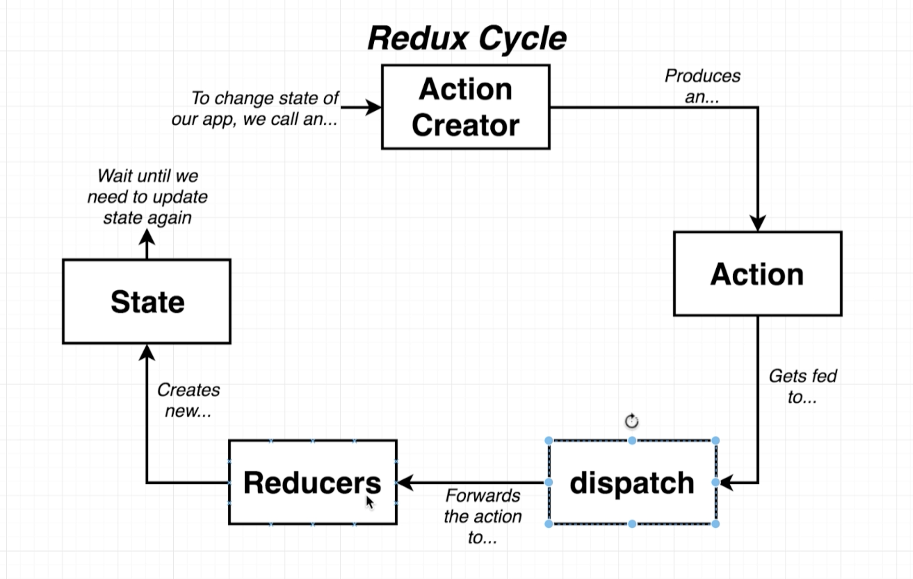

### Pure Redux Example

Use [CodePen](https://codepen.io/tolgatuna/pen/mdJrOgr) link to run this code and do not forget to add Redux from Settings before running that

```javascript
console.clear();

// --- ACTION CREATORS ---
const createPolicy = (name, amount) => {
  return { // Action for CREATE_POLICY
    type: 'CREATE_POLICY',
    payload: {
      name: name,
      amount: amount
    }
  }
};

const deletePolicy = (name) => {
  return { // Action for DELETE_POLICY
    type: 'DELETE_POLICY',
    payload: {
      name: name
    }
  }
};

const createClaim = (name, amountOfMoneyToCollect) => {
  return { // Action for CREATE_CLAIM
    type: 'CREATE_CLAIM',
    payload: {
      name: name,
      amountOfMoneyToCollect: amountOfMoneyToCollect
    }
  }
};

// --- REDUCERS ---
const claimsHistory = (oldListOfClaims = [], action) => {
  if(action.type === 'CREATE_CLAIM') {
    return [...oldListOfClaims, action.payload]
  }

  return oldListOfClaims;
};

const accounting = (bagOfMoney = 100, action) => {
  if(action.type === 'CREATE_CLAIM') {
    return bagOfMoney - action.payload.amountOfMoneyToCollect;
  } else if (action.type === 'CREATE_POLICY') {
    return bagOfMoney + action.payload.amount;
  }

  return bagOfMoney;
};

const policies = (listOfPolicies = [], action) => {
  if (action.type === 'CREATE_POLICY') {
    return [...listOfPolicies, action.payload];
  } else if (action.type === 'DELETE_POLICY') {
    return listOfPolicies.filter(
      policy => policy.name !== action.payload.name
    )       
  }

  return listOfPolicies;
};

const {createStore, combineReducers} = Redux;
const ourDepartments = combineReducers({
  accounting: accounting,
  claimsHistory: claimsHistory,
  policies: policies
});

const store = createStore(ourDepartments);

// --- TEST OUR CODE ---
store.dispatch(createPolicy('Alex', 20));
store.dispatch(createPolicy('Jim', 30));
store.dispatch(createPolicy('Bob', 40));
console.log(store.getState());

store.dispatch(createClaim('Alex', 120));
store.dispatch(createClaim('Jim', 50));
console.log(store.getState());

store.dispatch(deletePolicy('Bob'));
console.log(store.getState());
```

### Notes:

- An action creator is just a function and it should return json object which should contain type and payload

- A reducer can be thinkable as State store and responsible from the update any state with an action

- Adding to list with ... (ES2015 syntax) :

```javascript
const numbers = [1, 2, 3];
[...numbers, 4];
// new array will be created and it will be : [1, 2, 3, 4]
// If we say numbers.push(4), this is gonna add 4 to numbers.
// But with ... we are creating brand new array.
```

## SECTION 13 - Integrating React with Redux
### React-Redux

To install redux and react-redux libraries:

```
npm install --save redux react-redux
```

### React-Redux library

- `<Provider />` makes the Redux store available to any nested components that have been wrapped in the connect() function.
- `connect()` is a function which connects a React component to a Redux store.

	`function connect(mapStateToProps?, mapDispatchToProps?, mergeProps?, options?)`
	
	The `mapStateToProps` and `mapDispatchToProps` deals with your Redux store’s state and dispatch, respectively. state and dispatch will be supplied to your mapStateToProps or mapDispatchToProps functions as the first argument.
	
	The return of `connect()` is a __wrapper function__ that takes your component and returns a __wrapper component__ with the additional props it injects.
	
	- `mapStateToProps?: (state, ownProps?) => Object` : it can take all Redux store’s states and components props__(optional)__ as well.
	- `mapDispatchToProps?: Object | (dispatch, ownProps?) => Object` : it can be directly an object which contains actionCreators or like `mapStateToProps` it can be function which takes dispatch and components props__(optional)__ as well.


### React and Redux How we need to configure ?

- Reducer class should export combined reducers. Reducer actually means store which we are gonna keep our states and also if something changed by an action it needs to update itself.

```javascript
import {combineReducers} from "redux";

// SOME OTHER REDUCERS...

const selectItemReducer = (selected = null, action) => {
    if (action.type === 'SELECT_ITEM') {
        return action.payload;
    }
    return selected;
};

export default combineReducers({
    // SOME OTHER REDUCERS...
    mySelectedItem: selectItemReducer
});
```

- Our App component should be covered by a provider which is keeping store in index.js like that:

```javascript
import React from 'react';
import ReactDOM from 'react-dom';
import {Provider} from 'react-redux';
import {createStore} from 'redux';
import reducers from './reducers';
import App from './components/App';

ReactDOM.render(
    <Provider store={createStore(reducers)}>
        <App/>
    </Provider>,
    document.getElementById('root')
);
```

- Actions are just functions which returning json object with type (action type) and payload (data).

```javascript
// Action Creator
export const selectSong = (song) => {
    // Return an action
    return {
        type: 'SONG_SELECTED',
        payload: song
    }
};
```

- A component which wants to connect to our store (Redux side) should be covered with connect (Which is coming from react-redux lib) function

```javascript
import React, {Component} from "react";
import {connect} from "react-redux";

class SongList extends Component {
    constructor(props) {
        super(props);
        console.log(props);
    }
    render() {
        return <div>MyComponent</div>;
    }
}

const mapStateToProps = (state) => {
    //State Contains all store and we are selecting
    //what we need in that function
    return {myList: state.list};
};

export default connect(mapStateToProps)(SongList);
```

- If A component wants to dispatch some action, it should use an action creator. To use an action creator, it should add mapDispatchToProps array to connect function as second parameter. 

```javascript
import React, {Component} from 'react';
import {connect} from 'react-redux';
import {selectSong} from '../actions';

class SongComponent extends Component {
	render() {
		const {song, selectSong} = this.props;
		return (
			<div>
				<button onClick={() => selectSong(song)}>Select</button>
			</div>
		);
	}
}

// Function selectSong added as mapDispatchToProps as second parameter.
export default connect(
    null,
    {selectSong}
)(SongComponent);
```

### Redux is not a magic!

- Redux does not automatically detect `action creators` being called
- Redux does not automatically detect a function returning an object that is an `action`


## SECTION 14 - Async Actions with Redux Thunk
- Install redux-thunk

	```
	npm install --save redux react-redux axios redux-thunk
	```

	- redux __-->__ The redux library
	- react-redux __-->__ Integration layer between react and redux
	- axios __-->__ Helps us make network request
	- redux-thunk __-->__ Middleware to help us make request in a redux application

### What is Middleware Doing?
Asynchronous Action Creator: Takes some amount of time for it get its data ready to go

#### Redux cycle with middleware :
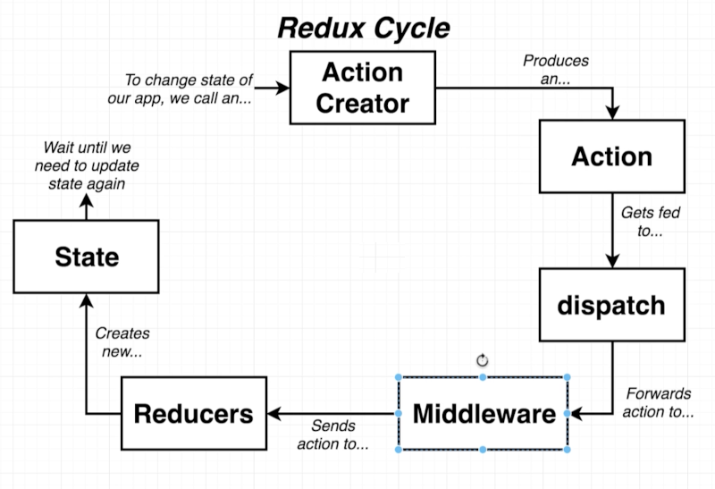

#### Middlaware in Redux
- Function that gets called with every action we dispatch
- Has the ability to `STOP` and `MODIFY`, or otherwise mess around with action
- Tons of open source middleware exist
- Most popular use of middleware is for dealing with async actions
- We are going to use a middleware called `Redux-Thunk` to solve our async issues

### Action Creator Properties
##### Normal Rules for Action Creator
- Action creator **must** return plain JS objects with a `type` property
- Actions must have a `type` property
- Actions can optionally have a `payload`

##### Rules with `Redux-Thunk`
- Action Creators **can** return action objects
**or**
- Action Creators **can** return functions!

#### How Redux-Thunk and Action works together?

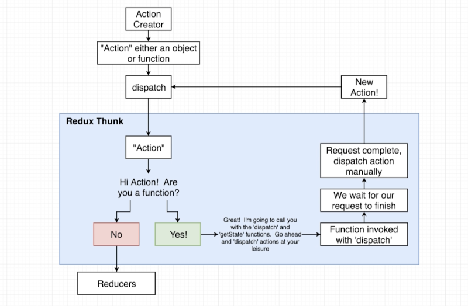

### Implementing thunk in React app

Index file should create store with applyMiddleware and thunk

```javascript
import React from 'react';
import ReactDOM from 'react-dom';
import App from './components/App';
import {Provider} from "react-redux";
import {createStore, applyMiddleware} from "redux";
import reducers from './reducers'
import thunk from 'redux-thunk';

const store = createStore(reducers, applyMiddleware(thunk));

ReactDOM.render(
    <Provider store={store}>
        <App/>
    </Provider>,
    document.getElementById('root')
);
```

Action should return a function which is dispatching our plain object

```javascript
export const fetchPost = () => async dispatch => {
    const promise = await jsonPlaceholder.get('/posts');
    dispatch({type: "FETCH_POST", payload: promise});
};
```

### NOTES
- Arrow Function : <br/>
	__That lots of arrow function__

	```javascript
	export const fetchPost = () => async dispatch => {
	    const promise = await jsonPlaceholder.get('/posts');
	    dispatch({type: "FETCH_POST", payload: promise});
	};
	```
	
	__means__
	
	```javascript
	export const fetchPost = () => {
	    return async dispatch => {
	        const promise = await jsonPlaceholder.get('/posts');
	        dispatch({type: "FETCH_POST", payload: promise});
	    };
	};
	```
	
	__and that means__
	
	```javascript
	export const fetchPost = () => {
	    return async function(dispatch) {
	        const promise = await jsonPlaceholder.get('/posts');
	        dispatch({type: "FETCH_POST", payload: promise});
	    };
	};
	```

- Exact code of redux-thunk :D
	
	```javascript
	function createThunkMiddleware(extraArgument) {
		return ({ dispatch, getState }) => (next) => (action) => {
			if (typeof action === 'function') {
				return action(dispatch, getState, extraArgument);
			}
			
			return next(action);
		};
	}
	
	const thunk = createThunkMiddleware();
	thunk.withExtraArgument = createThunkMiddleware;
	
	export default thunk;
	```
	

## SECTION 15 - Redux Store Design
### Rules of Reducers

- When react application runs with redux, all reducers called with undefined first time. That means all default values setted up at the beginning.
- Must return any value besides 'undefined'
- Produces 'state', or data to be used inside of your app using only previous state and the action (reducers are pure)
- Must not return to react 'out of itself' to decide what value to return

	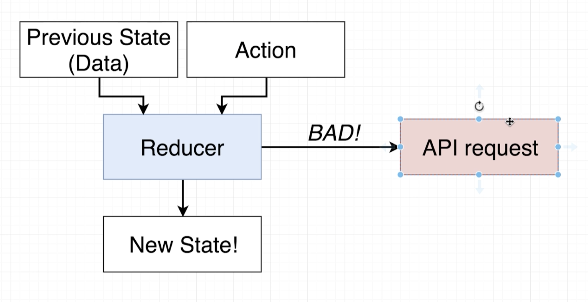
	
- Must not mutate its input 'state' argument

```javascript
export default (state, action) => {
  // BAD!
  state[0] = 'SAM';
  state.pop():
  state.push('SOMETHING'):

  // BAD!
  state.name = 'SAM';
  state.age = 30;

  // Strings and numbers are immutable in JavaScript
  const name = 'SAM';
  name[0] = 'X'
  // if you print name again it is gonna be SAM again.
};
```

- Good way of return new array or an object :

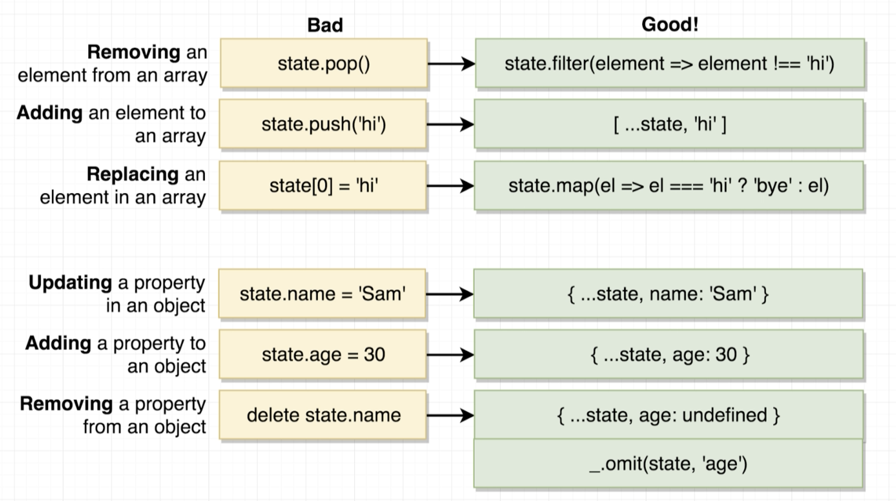

## SECTION 16 - Navigation with React Router

- Install react-router-dom:

	```
	npm install --save react-router-dom
	```

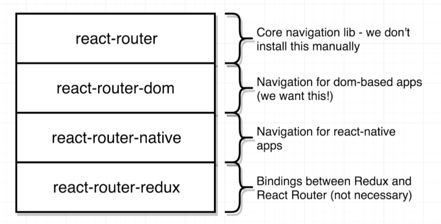

### React Router Simple Usage Example

```JavaScript
import React from 'react';
import {BrowserRouter, Route} from "react-router-dom";

const PageOne = () => {
    return <div>Page One</div>;
};

const PageTwo = () => {
    return <div>Page Two</div>;
};


const App = () => {
	return (
		<BrowserRouter>
			<div>
				<Route path='/' exact component={PageOne}/>
				<Route path='/pagetwo' component={PageTwo}/>
			</div>
		</BrowserRouter>
	);
};

export default App;
```

### How React Router Works

- Paths which are cared by React Router

	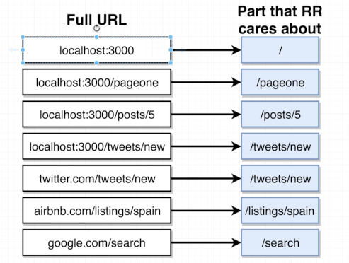

- Simple Diagram of React Router Works

	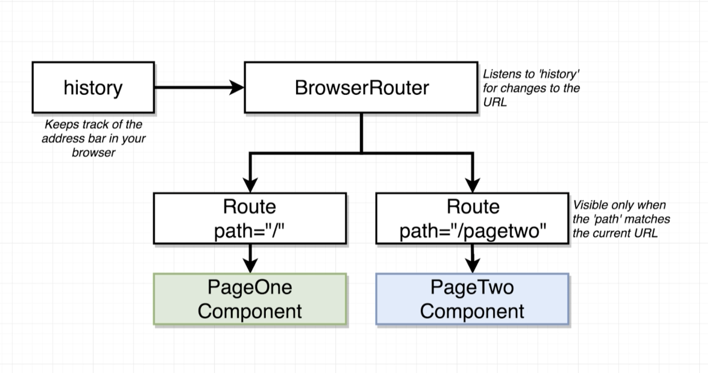

### How Paths Get Matched

Only `/`

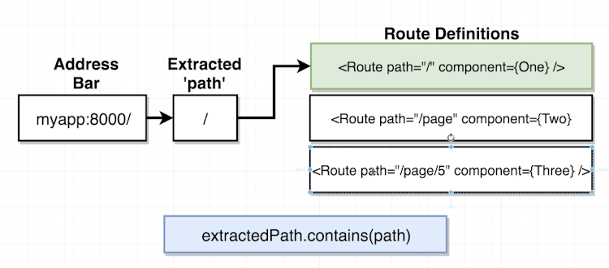

`/` and `page`

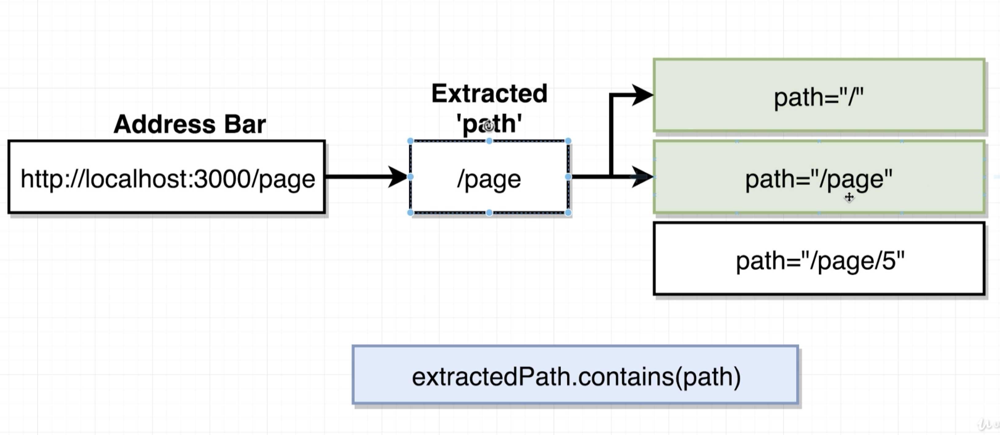

`/` `page` and `5`

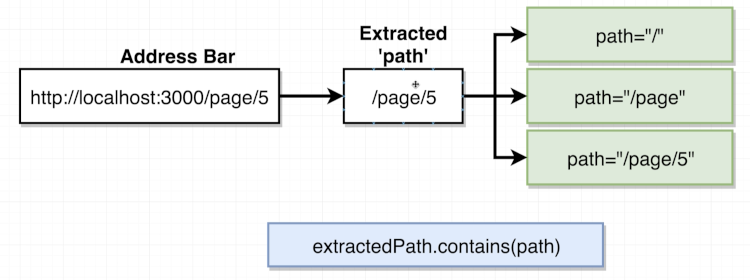

### Different Router Types

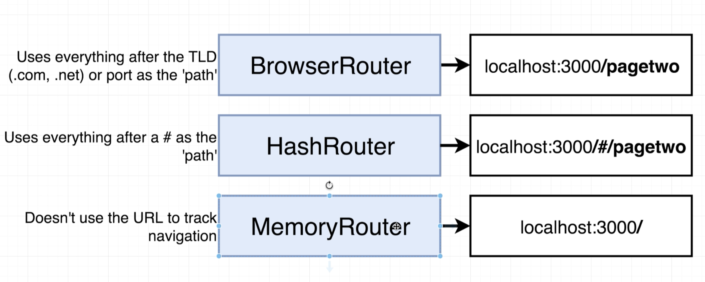

### NOTES
- exact means only display that exactly matched component. On the other hand React will display other components. For example you want to display `/page/5`. If you do not put exact for `/` route, React will display `/` and `/page/5` together. Check the image about `/` `page` and `5`. It is actually matching with all. If you do not put any exact, React will show three elements.
- Never Use `<a>` tag in react app! (If you use anchor tag in your application, you application will start itself again to go that anchor path!). USE `<Link to='...'>` tag! 
- Use single element inside a Router element.
- `<Switch>` looks through all its children `<Route>` elements and renders the first one whose path matches the current URL. Use a `<Switch>` any time you have multiple routes, but you want only one of them to render at a time

## SECTION 17 - Handling Authentication with React
- Project used client side google authentication. Here is an example component for sign in button of google:
	
	```javascript
	import React from "react";
		
	class GoogleAuth extends React.Component {
		state = {isSignedIn: null}
			
		componentDidMount() {
			window.gapi.load('client:auth2', () => {
				window.gapi.client.init({
					clientId: 'YOUR_CLIENT_ID_FOR_AUTH',
					scope: 'email'
				}).then(() => {
					this.auth = window.gapi.auth2.getAuthInstance();
					this.setState({isSignedIn: this.auth.isSignedIn.get()})
					this.auth.isSignedIn.listen(() => {
						this.setState({isSignedIn: this.auth.isSignedIn.get()})
					})
				})
			});
		}
			
		onSignInClicked = () => {
			this.auth.signIn();
		}
			
		onSignOutClicked = () => {
			this.auth.signOut();
		}
			
		renderAuthButton() {
			if (this.state.isSignedIn === null) {
				return null;
			} else if (this.state.isSignedIn) {
				return (
					<button onClick={this.onSingInClicked} className='ui red google button'>
						<i className='google icon'/>
						Sign Out
					</button>
				);
			} else {
				return (
					<button onClick={this.onSignOutClicked} className='ui red google button'>
						<i className='google icon'/>
						Sign In With Google
					</button>
				);
			}
		}
			
		render() {
			return this.renderAuthButton();
		}
	}
	
	export default GoogleAuth;
	```
	
## SECTION 18 - Redux Dev Tool
- [Redux DevTools](https://github.com/zalmoxisus/redux-devtools-extension/) : In chrome check Home -> Extensions -> Redux DevTools and install __Redux DevTools__
- To use tool with any react-redux project, need to add given configuration to react-redux app:
	- import `{applyMiddleware, compose}` from `redux`
	- create func `const composeEnhancers = window.__REDUX_DEVTOOLS_EXTENSION_COMPOSE__ || compose;`
	- use `composeEnhancers` function with `composeEnhancers(applyMiddleware())`
	- Full implementation:

		```javascript
		import {createStore, applyMiddleware, compose} from "redux";
			
		const composeEnhancers = window.__REDUX_DEVTOOLS_EXTENSION_COMPOSE__ || compose;
		
		ReactDOM.render(
			<Provider store={createStore(reducers, composeEnhancers(applyMiddleware()))}>
				<App/>
			</Provider>,
			document.getElementById('root')
		);
		```
- Debug Session with Redux Dev Tools: `localhost:3000?debug_session=<SOME_STRING>`, with that usage if you refresh you page with same `<SOME_STRING>`, tool will continue from your given session.

## SECTION 19 - Handling Forms with Redux Form
- Install redux-form:

	```
	npm install --save redux-form
	```
	
- Documentation: [Redux Form Link](https://redux-form.com/)
	
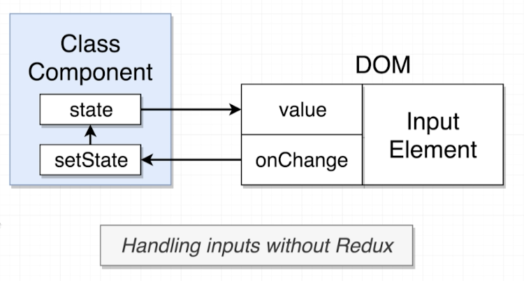

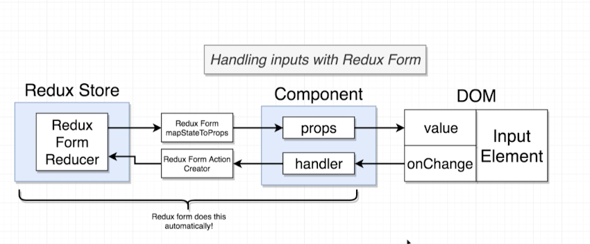

- To use redux form 
	- First need to import redux-form reducer with specific name `form` into reducers:

		```javascript
		import {combineReducers} from 'redux';
		import {reducer as formReducer} from 'react-form';
		
		export default combineReducers({
			// Other Reducers....
			form: formReducer,
			//... Some Other Reducers....
		})
		```
		
	- Secondly surround component with `reduxForm` function like `connect` function:
	
		```javascript
		import React, {Component} from "react";
		import {Field, reduxForm} from "redux-form";
		
		class MyComponent extends Component {
			render() {
				return <div> Will Be Form...</div>;
			}
		}
			
		export default reduxForm({
			form: 'GiveANameForYourForm'
		})(MyComponent);
		```
		
- Simple usage:

	```javascript
	import React, {Component} from "react";
	import {Field, reduxForm} from "redux-form";
		
	class MyComponent extends Component {
		renderInput(fieldProps) {
			return (
				<input
					onChange={fieldProps.input.onChange}
					value={fieldProps.input.value}
				/>
			);
		}
			
		render() {
			return (
				<form>
					<Field name='title' component={this.renderInput}/>
				</form>
			);
		}
	}
		
	export default reduxForm({
		form: 'myComponentForm'
	})(MyComponent);
	```
	
- Don't need to write `onChange={fieldProps.input.onChange}` and `value={fieldProps.input.value}` manually:
	
	```javascript
	renderInput(fieldProps) {
		return <input {... fieldProps.input}/>;
	}
	```
	
	__or more basically__
	
	```javascript
	renderInput({input}) {
		return <input {...input}/>;
	}
	```
- Don't need to write `event.preventDefault()` for form `submit` :
	
	```javascript
	onSubmit(formValues) {
		// Directly form values will come.
	}
		
	render() {
		return (
			<form conSubmit={this.props.handleSubmit(this.onSubmit)}>
				// Other fields....
				<button type="submit">Submit</button>
			</form>
		);
	}
	```
- Validation:
	
	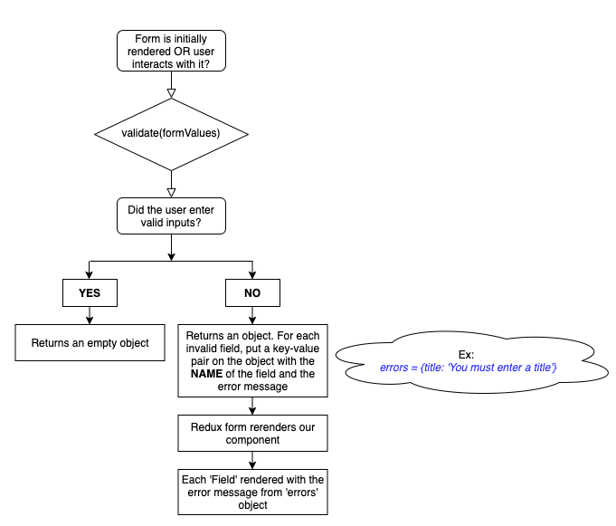

	- Create a validate function and give as parameter to `reduxForm` as `validate`
	- Returns an errors object. If there is no error return `{}` empty object.

		```javascript
		const validate = (formValues) => {
			const errors = {};
			if (!formValues.fieldName) {
				errors.fieldName = 'You must enter bla bla ...';
			}
			return errors;
		}
		
		export default reduxForm({
			form: 'MyForm',
			validate: validate
		})(StreamCreate);
		```
- Full example of simple redux form with validation:

	```javascript
	import React, {Component} from "react";
	import {Field, reduxForm} from "redux-form";
	
	class MyComponent extends Component {
		onSubmit(formValues) {
			console.log('Submitted:', formValues);
		}
		
		renderError = (meta) => {
			const {error, touched} = meta;
			if (touched && error) {
				return (
					<div>{error}</div>
				);
			}
		}
		
		renderInput = ({input, label, meta}) => {
			return (
				<div>
					<label htmlFor={input.name}>{label} : </label>
					<input id={input.name} {...input} autoComplete='off'/>
					{this.renderError(meta)}
				</div>
			);
		}
		
		render() {
			return (
				<form onSubmit={this.props.handleSubmit(this.onSubmit)}>
					<Field name='myField' component={this.renderInput} label='Enter Value'/>
					<button type="submit">Submit</button>
				</form>
			);
		}
	}
	
	const validate = (formValues) => {
		const errors = {};
		if (!formValues.myField) {
			errors.myField = 'You must enter a myField value';
		}
		return errors;
	}
	
	export default reduxForm({
		form: 'MyComponentForm',
		validate: validate
	})(MyComponent);
	```

## COURSE PROJECTS

| Sections       | Projects       | 
|----------------|----------------|
| 1 2            | 01_helloworld  |
| 3              | 03_components  |
| 4 5 6          | 04_seasons     |
| 7 8 9 10       | 07_pics        |
| 11             | 11_videos      |
| 13             | 13_songs       |
| 14 15          | 14_blog        |
| 16 17 18 19 20 | 16_streams     |


## EXTRA INFORMATIONS
- Import everything with name:
	
	```javascript
	import * as Types from './actionTypes'
	```

- Import a component with different name:

	```javascript
	import {reducer as formReducer} from 'redux-form'
	```

- Install lodash library: `npm install --save lodash` which is a modern JavaScript utility library delivering modularity, performance & extras. Some lodash informations:
	- Generally used with `_` (__underscore__)
	- `_.memoize(func, [resolver])` : Creates a function that memoizes the result of func. If resolver is provided, it determines the cache key for storing the result based on the arguments provided to the memoized function. By default, the first argument provided to the memoized function is used as the map cache key. The func is invoked with the this binding of the memoized function.

	
